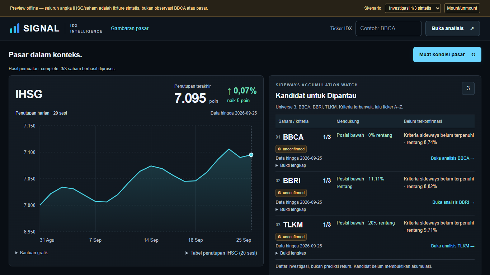
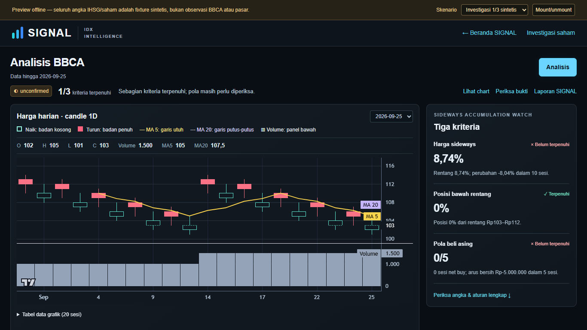

# MarketLens — Post-Market Stock Intelligence

MarketLens is an individual learning prototype for exploring post-market IDX price action and foreign flow. It helps me study market intelligence, the Sectors API, data processing, charting, and rule-based investigation. It organizes evidence around a **Sideways Accumulation Watch**; it does not establish that accumulation or manipulation occurred.

## What the MVP does

- Loads daily IHSG closes and a small watch universe: **BBCA, BBRI, and TLKM**.
- Ranks watch candidates by the number of investigation criteria met, then ticker A–Z for ties. This is an ordering for review, not a return forecast.
- Provides a manually loaded ticker investigation with a daily candlestick chart, volume, MA5/MA20, supporting and opposing evidence, and a six-stage MarketLens report.
- Shows incomplete and failed sources separately; a failed symbol does not erase other successful results.

### Investigation criteria

The existing rule set evaluates three conditions:

1. **Sideways price:** closes over 10 available sessions have a range of at most 5%, and the absolute first-to-last change is at most 2%.
2. **Lower part of the range:** the latest close is at or below the 30th percentile of the 10-session price range.
3. **Foreign buying pattern:** at least 3 of the latest 5 sessions are net-buy sessions and their combined net flow is positive.

The status is derived from these criteria and data availability (`candidate`, `unconfirmed`, `not_matching`, or `insufficient_data`). Volume compares averages for the latest five available sessions and the five before them; it is context, not proof of accumulation.

## Data and loading

The application uses Sectors daily OHLCV and foreign-flow sources for equities, plus the daily IHSG index close. IHSG is shown as a closing-price line because its source does not provide OHLC candles. Data is daily, and the displayed source date may be earlier than today, especially on weekends or holidays.

Data loading is user initiated. Opening the landing page does not load market data; select **Muat kondisi pasar**. Search for a symbol or follow a watch row to open its detail page; detail data loads only after **Analisis** is pressed. There is no intraday feed or automatic refresh.

## Live smoke test previously completed

A single manual landing smoke test was completed earlier in the project; this README records that result and does not trigger another request. IHSG and BBCA, BBRI, and TLKM loaded successfully with source data through **25 September 2026**. Each of the three equity investigations returned **unconfirmed, 1/3 criteria met**. These are historical observations from that smoke test, not a promise that a later run returns the same data or status. No API key or raw response is included here.

## Synthetic fixtures and live data

Offline previews and automated tests use local, **synthetic fixtures**. They are deliberately marked as synthetic in the preview UI and are not historical observations, even when a fixture uses a real IDX ticker label. Screenshots below come from that preview and show the fixture notice. Do not use fixture values as market information.

| MarketLens landing with synthetic fixture | BBCA detail with synthetic fixture |
| --- | --- |
|  |  |

## Run locally

Requirements: Node.js and npm. Install dependencies and start the Next.js app:

```sh
npm ci
npm run dev
```

For live requests, create a local `.env.local` with `SECTORS_API_KEY` set to a valid Sectors API key. Keep that file local; `.env*` is ignored by Git. The app does not need the key to build UI from fixtures, but the production data routes require it when a user explicitly loads data.

### Offline preview

The standalone preview renders the same landing and detail components using local fixtures. It does not start the Next server or call Sectors:

```sh
node testing/chart-preview.cjs --market
```

Open `http://127.0.0.1:4313/?scenario=review`, then press **Muat kondisi pasar**. Other offline cases are `full`, `partial`, `empty`, `error`, `load-error`, `short`, and `index-error`, for example `http://127.0.0.1:4313/?scenario=partial`. The browser regression runner starts its own isolated preview:

```sh
node testing/preview-browser.cjs
```

Pure analysis and fixture regressions:

```sh
npx tsc --noEmit
node testing/session1.cjs
node testing/session2.cjs
node testing/session3.cjs
npm run lint
```

## Limitations

- Daily closing/session data only; no intraday prices, running trade, order book, broker queue, or execution data.
- The MVP watch universe contains three tickers, not the full IDX market.
- Status and ranking summarize rule checks. They do not prove accumulation, predict returns, estimate profit probability, or provide buy/sell instructions.
- News, corporate actions, fundamentals, and sector context have not been checked. The app cannot infer them as causes of a price move.
- Historical fixture data is synthetic. A live smoke test confirms only the specific sources and dates observed at that time.
- This is an individual learning prototype; the scope may change as the implementation and data understanding develop.
